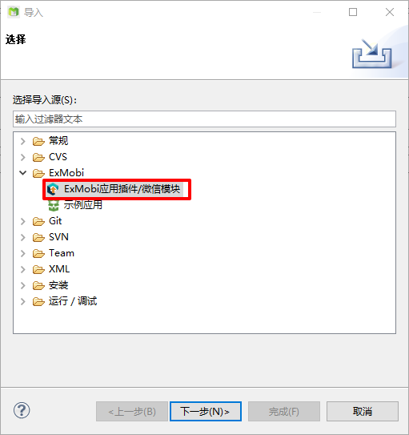
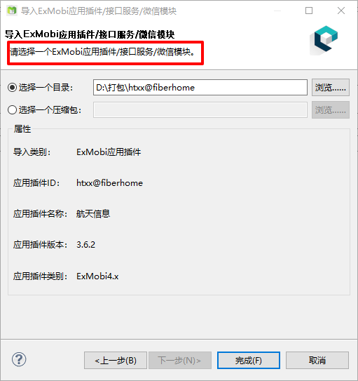
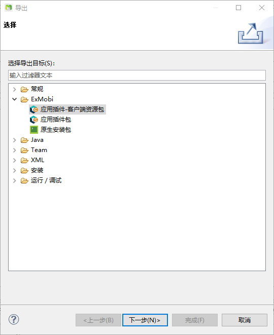
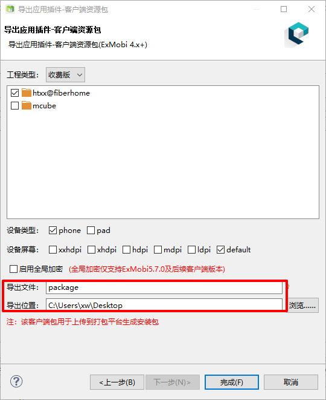
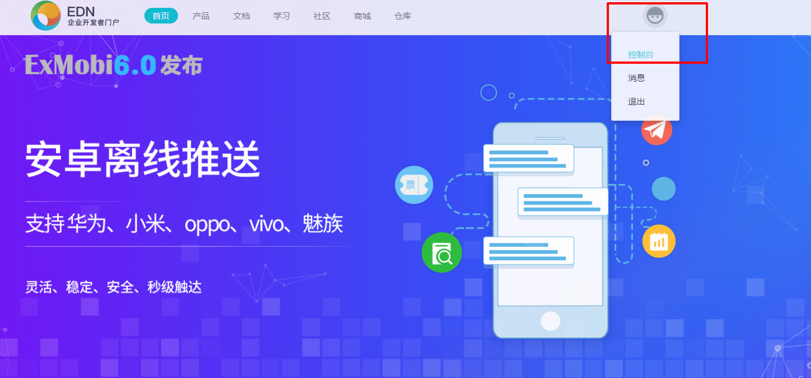
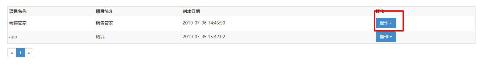
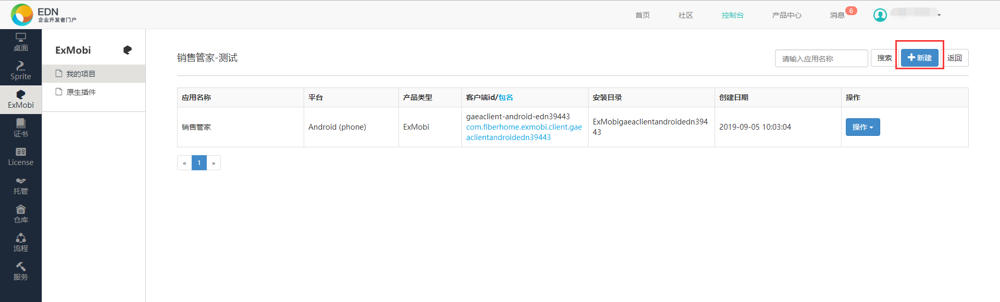
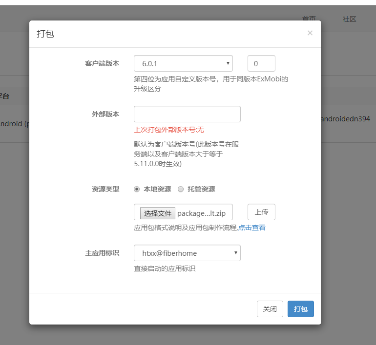
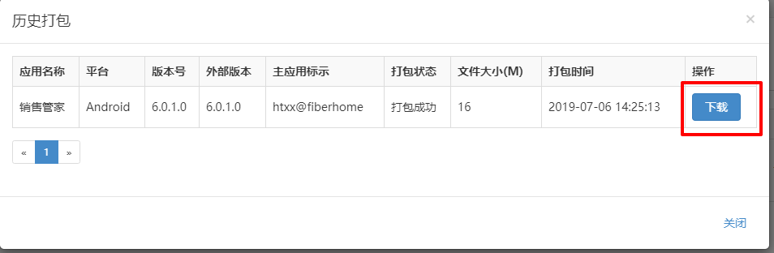

---

---

## ExMobi打包流程

### 1 MBuilder使用

#### 1.1 应用插件代码导入

打开MBuilder，点击文件--导入--选择ExMobi目录--ExMobi应用插件/微信模块，如图:

点击下一步，进入选择插件包目录页面，可以导入一个目录，页可导入一个压缩包，选择ExMobi插件后点击完成即可导入成功，如图：

#### 1.2 导出为客户端资源包

点击文件，选择导出--选择ExMobi目录下应用插件--客户端资源包，如图：

点击下一步，选择工程类型，如图。可以修改导出文件名称以及导出位置。点击完成，导出成功。

### 2 EDN打包

#### 2.1 新建项目

登录EDN账号，选择控制台，如图:

选择ExMobi，点击新建。比如说创建了销售管家这个项目，点击操作，选择进入应用。如图:

点击新建，这里产品类型选择ExMobi，平台以及设备类型根据实际情况选择。点击下一步，填写相应内容（Android不需要证书），然后点击保存。效果如图：

#### 2.2 打包

点击操作，选择打包，进入打包窗口，资源类型选择本地资源，上传在MBuilder中导出的zip（客户端资源包）包，如下图：

点击打包，打包成功。查看打包历史，查看打包是否成功，成功后效果如下图，点击下载即可。

