## 1 准备条件

MAC电脑。

苹果企业帐号及密码。

证书密码。

edn帐号及密码。

## 2 CSR申请

注意：CSR文件在打包证书申请、推送证书申请等过程均会使用到

（1）打开“钥匙串”应用，按下图红框选择“钥匙串访问”--”证书助理“--”从证书颁发机构请求证书“ 

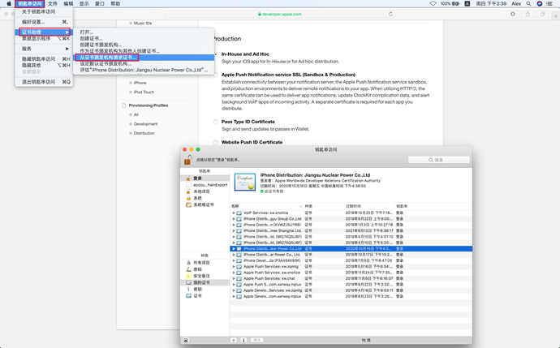

（2）填写用户电子邮箱地址，选择存储到磁盘，点击继续

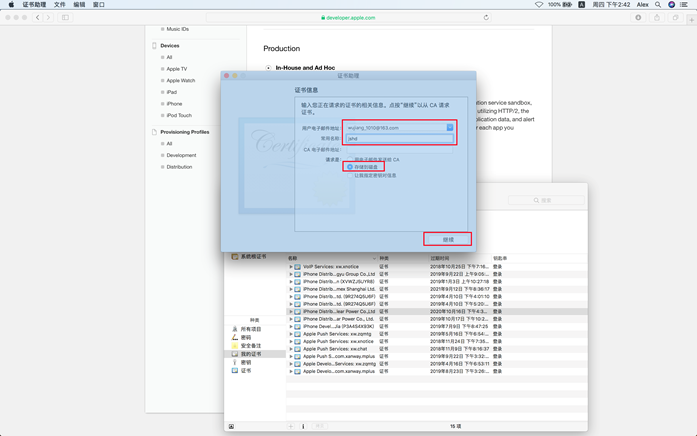

（3）点击完成

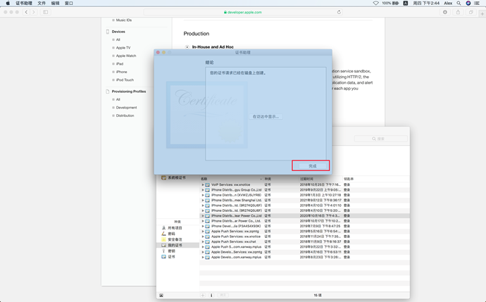

（4）选择相应目录及设置文件名，点击存储。注意要保留好此文件。

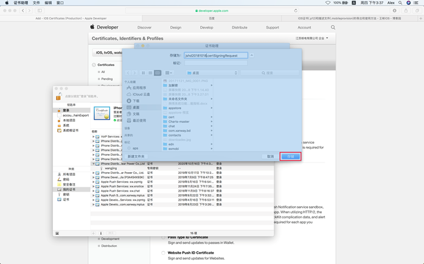

## 3 推送证书过期重新申请

（1）登录苹果企业账号，打开Certificates，Identifiers&Profile页面。如下图，Certificates为证书页面。点击加号，新建证书。

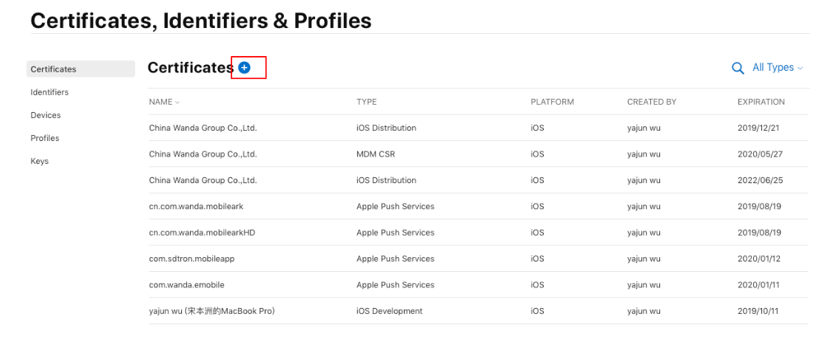

（2）按下图选中相应选项，点击“Continue”继续

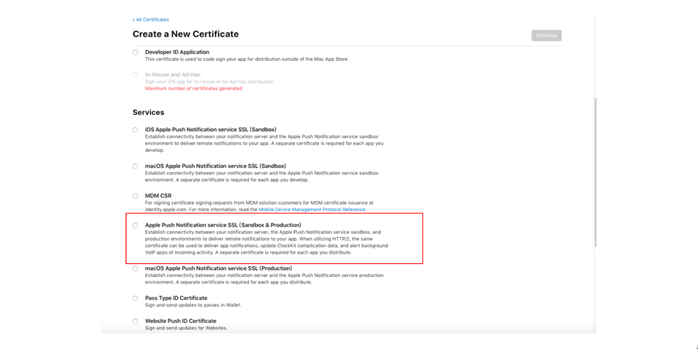

（3）选择App ID，点击“Continue”

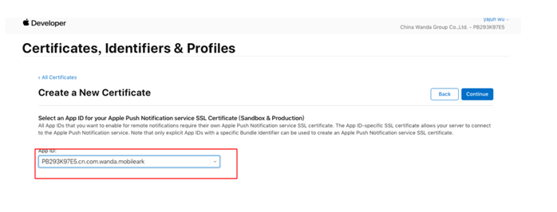

（4）点击“Choose File”选择CSR，然后点击“Continue”即可新增证书

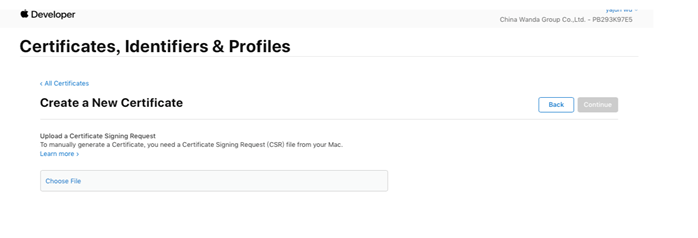

（5）新建完成后，点击“Download”下载，找到下载下来的文件，双击该文件，然后到“钥匙串”中找到相应项

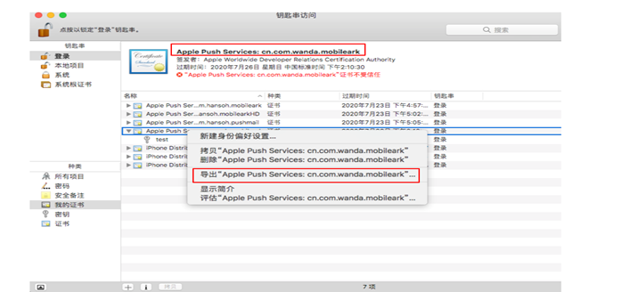

（6）右键选择导出证书（.p12格式），选择好存储目录、设置文件名后，点击“存储”按钮

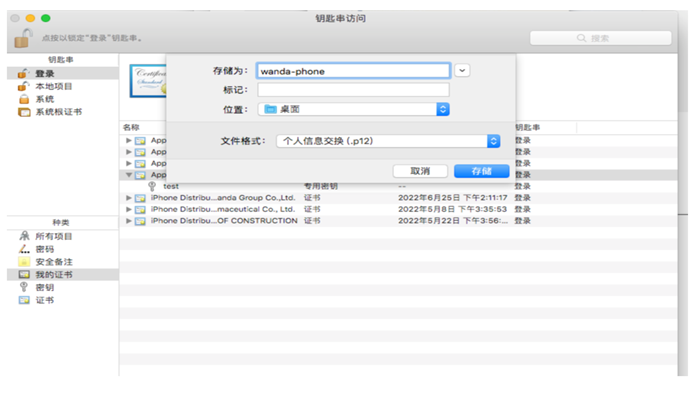

（7）设置P12文件密码，然后点击“好”

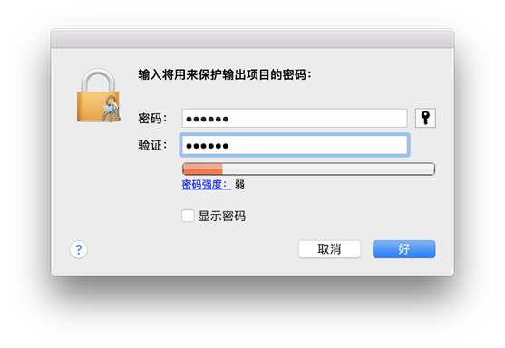

（8）输入MAC登录密码，点击“允许”，推送证书就生成好了。

## 4 打包证书过期重新申请

（1）点击Certificates（证书）页的新增按钮，企业级证书选择In-House and Hdc选项（每个企业账号最多申请两个企业级证书），点击页面右上方的“Continue”按钮继续

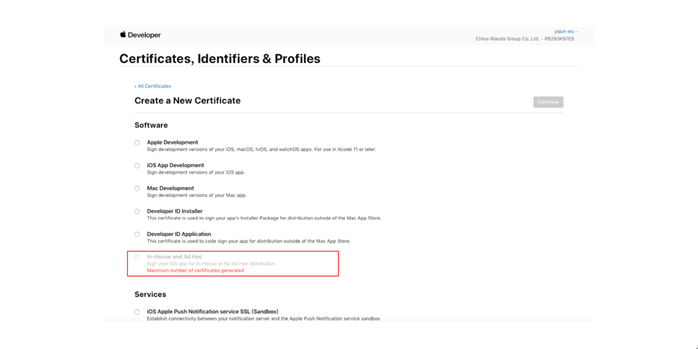

（2）点击Choose File按钮，选择CSR文件，然后点击“Continue

（3）下载该证书，然后导出P12文件，导出方法参考“推送证书过期重新申请章节”

## 5 描述文件过期申请

（1）登录苹果企业账号，点击Profiles页面，找到过期的描述文件（过期文件状态Expired），见下图

（2）点击过期文件，弹出该文件详细信息，选择最新的证书，点击右上角的Save，再点击Download，下载即可

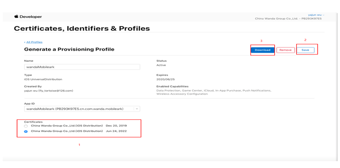

## 6 EDN更新证书

（1）登录edn帐号。点击控制台--证书--我的证书，找到相应证书，点击操作--更新。

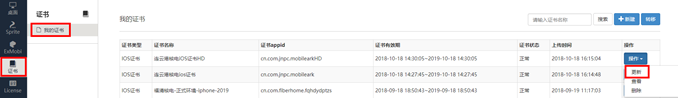

（2）上传证书文件和描述文件，设置好后点击保存。

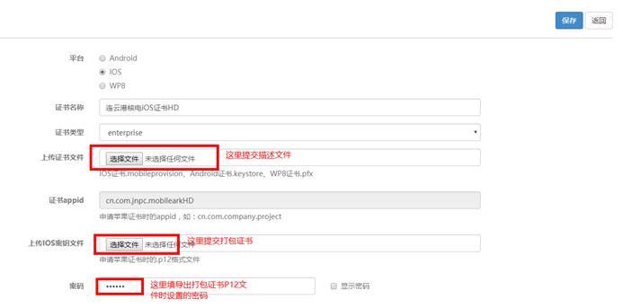

